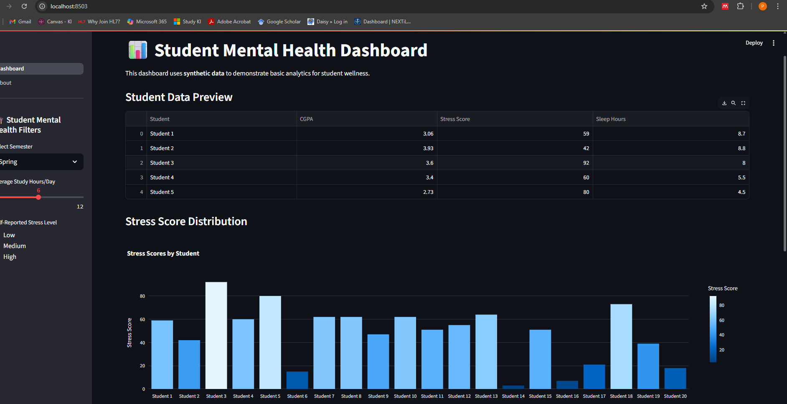
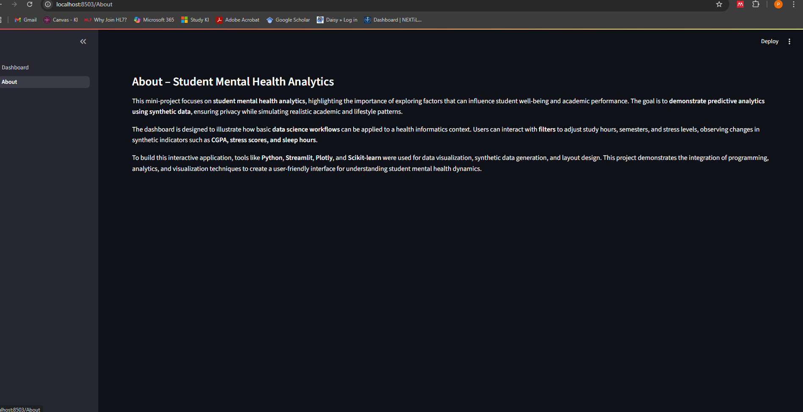

# PROHI Dashboard Example

**Author**: [Pratibha Rustogi]
<!-- As main author, do not write anything in the line below.
The collaborator will edit the line below in GitHub -->
**Collaborator**: Anna Larsson
**Collaborator**: Chantale NzeggeMvele


# 📊 Student Mental Health Dashboard

This project is a **mini interactive web dashboard** built with **Streamlit** as part of the DSHI course.  
It demonstrates a small-scale predictive analytics workflow using **synthetic data** to mimic student mental wellness information.  

---

## ✨ Features  
- **Two Pages**:  
  - **Dashboard** – Displays synthetic student data, filters, and interactive charts.  
  - **About** – Summarizes the project’s purpose and tools.  
- **Interactive Filters**: Semester selector, average study hours slider, and self-reported stress level.  
- **Visualizations**: Plotly bar chart for stress scores and additional data previews.  
- **Data Table**: Shows a preview of synthetic student records.  

---

## 🛠️ Tools and Libraries  
- **Python 3.12**  
- **Streamlit 1.46**  
- **Plotly**  
- **NumPy**  
- **Pandas**  

---

## 📊 Dataset Overview  
The **Student Mental Health Dashboard** uses **synthetic data** to mimic realistic student wellness information.  
The dataset contains **20 synthetic student records** with the following features:  

| Column          | Description                                                        | Example Values        |
|-----------------|------------------------------------------------------------------|----------------------|
| **Student**     | Synthetic identifier for each student (not real individuals).     | Student 1, Student 2 |
| **CGPA**        | Randomly generated cumulative grade point average (2.5 – 4.0).    | 3.06, 3.93, 3.60     |
| **Stress Score** | Random integer representing self-reported stress level (1 – 100).| 59, 42, 92           |
| **Sleep Hours**  | Average sleep hours per day (random float between 4 – 9).        | 8.7, 5.5, 4.5        |

### 🔎 Insights Demonstrated
- **Stress Score Distribution**: A Plotly bar chart visualizes the variation in student stress scores.  
- **Sleep Hours vs CGPA**: Shows potential relationships between academic performance and sleep.  
- **Filters**: Sidebar widgets let you explore subsets of data interactively.  

> 🧪 **Note**: This dataset is **synthetic**—created with NumPy for demonstration purposes. It does not represent real student data.

## 📸 Screenshots  

### Dashboard Page  
  

### About Page  
  


---

## 🚀 How to Run Locally  
1. Clone this repository and navigate to the folder:  
   ```bash
   git clone <your-repo-url>
   cd PROHI-starting-repo
 

## Contributors

_Pratibha Rustogi
